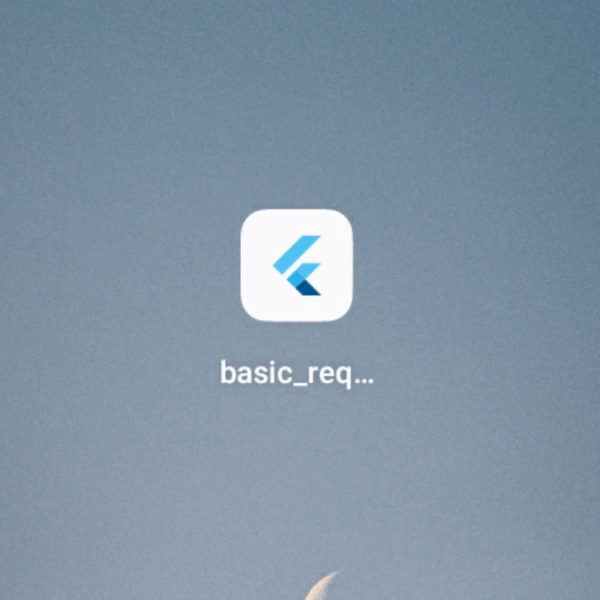
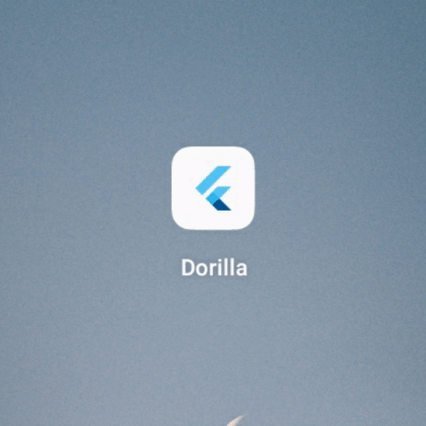
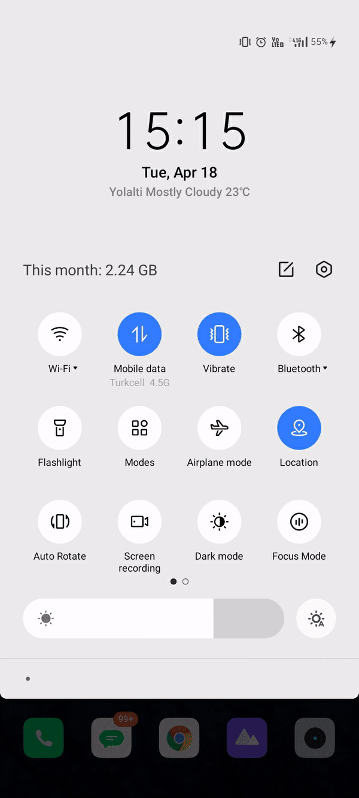
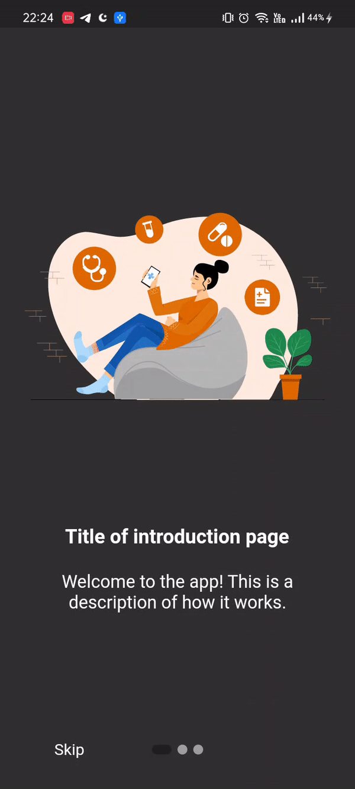
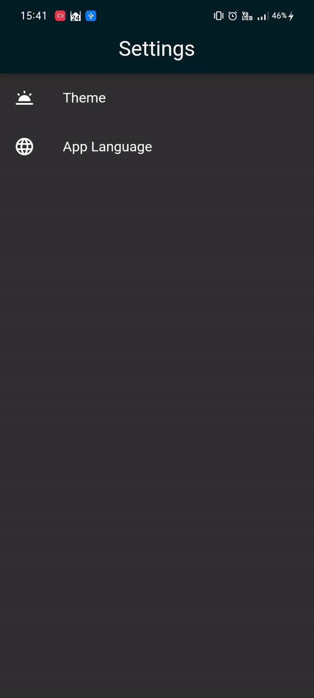
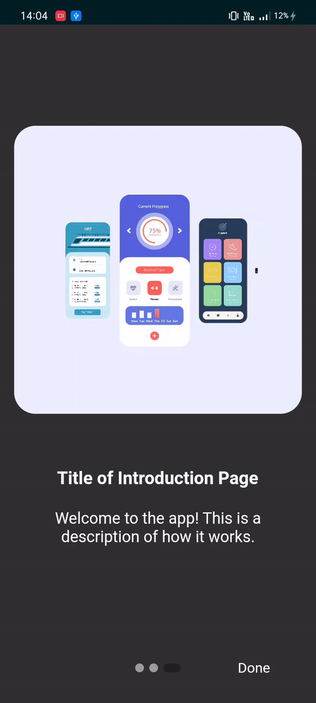

# Basic Requirements Package For Flutter Apps

- [Change app name](#app-name) ✓
- [Change App Icon](#app-icon) ✓
- [Splash Screen](#splash-screen) ✓
- [Onboarding/Introduction](#onboarding) ✓
- [Change Theme With Caching](#theme) ✓
- [Localization](#localization) ✓
- [Rouiting](#routing) ✓


<a id="app-name"></a>

## Change App Name

<details style="margin:15px">
  <summary style="font-size:20px"> Usage</summary>
  
#### Android

Go to android manifest.xml.

```
android / app / src / main / AndroidManifest.xml
```

Change android label with your app name.

```
<application
          android:name="io.flutter.app.FlutterApplication"
          android:label="App Name"
          android:icon="@mipmap/launcher_icon">
```

#### Ios

Go to Info.plist.

```
ios / Runner / Info.plist
```

Change bundle name with your app name.

```
<key>CFBundleName</key>
<string>App Name</string>
```

</details>

<p>
  
</p>

<a id="app-icon"></a>

## Change App Icon

<details style="margin:15px">
  <summary style="font-size:20px"> Usage</summary>
  
#### Android & Ios

Add last version of flutter_launcher_icons package in dev_dependencies.

```
dev_dependencies:
  flutter_launcher_icons: "^0.13.0"
```

Add your app icon path in pubspec.yaml/assets.

```
assets:
    - assets/icon/icon.png
```

Add your Flutter Launcher Icons configuration to your pubspec.yaml

```
flutter_icons:
  android: true
  ios: true
  image_path: "assets/icon/icon.png"

```

İf you want to change icon also web, windows, macos then add this:

```
web:
    generate: true
    image_path: "path/to/image.png"
    background_color: "#hexcode"
    theme_color: "#hexcode"
  windows:
    generate: true
    image_path: "path/to/image.png"
    icon_size: 48 # min:48, max:256, default: 48
  macos:
    generate: true
    image_path: "path/to/image.png"
```

After setting up the configuration, run the package.

```
flutter pub get
flutter pub run flutter_launcher_icons
```

</details>

<p>
  
</p>

<a id="splash-screen"></a>

## Splash Screen

<details style="margin:15px">
  <summary style="font-size:20px"> Usage</summary>
  
#### Android & Ios

Add last version of flutter_native_splash package in dev_dependencies.

```
dev_dependencies:
  flutter_native_splash: ^2.2.19
```

Add your app logo pubspec.yaml/assets.

```
assets:
    - assets/logo/
```

Add your Flutter Native Splash configuration to your pubspec.yaml

```
flutter_native_splash:
  color: "#dcd5cd"
  image: assets/logo/logo.png
  color_dark: "#1b1106"
  image_dark: assets/logo/logo_dark.png

  android_12:
    image: assets/logo/logo.png
    icon_background_color: "#dcd5cd"
    image_dark: assets/logo/logo_dark.png
    icon_background_color_dark: "#1b1106"

  web: false
```

After setting up the configuration, run the package.

```
flutter pub get
flutter pub run flutter_native_splash:create
```

</details>

<p>
  
</p>

<a id="theme"></a>

## Change Theme with Caching

<details style="margin:15px">
  <summary style="font-size:20px"> Usage</summary>
  
#### Android & Ios

Add last version of flutter_bloc package for state management and hive, hive_flutter for caching in dependencies.

```
dependencies:
  flutter_bloc: ^8.1.2
  hive: ^2.2.3
  hive_flutter: ^1.1.0
```

Add last version of build_runner package and hive_generator in dev dependencies.

```
dev_dependencies:
  build_runner: ^2.3.3
  hive_generator: ^2.0.0
```

Create theme classes for your themes and create cubit class for your thememode value. Create box with hive and make caching.

</details>

<p>
  
  
</p>

<a id="localization"></a>

## Localization

<details style="margin:15px">
  <summary style="font-size:20px"> Usage</summary>
  
#### Android & Ios

Add last version of easy_localization in dependencies.

```
dependencies:
  easy_localization: ^3.0.1
```

Create folder and add translation your local files.

```
assets
└── translations
    ├── en-US.json
    └── tr-TR.json
```

Add assets localization directory in pubspec.yaml

```
flutter:
  assets:
    - assets/translations/
```

Add easy localization widget.

```
import 'package:flutter/material.dart';
import 'package:flutter_localizations/flutter_localizations.dart';
import 'package:easy_localization/easy_localization.dart';

void main() async {
  WidgetsFlutterBinding.ensureInitialized();
  await EasyLocalization.ensureInitialized();

  runApp(
    EasyLocalization(
      supportedLocales: [Locale('en', 'US'), Locale('de', 'DE')],
      path: 'assets/translations', // <-- change the path of the translation files
      fallbackLocale: Locale('en', 'US'),
      child: MyApp()
    ),
  );
}

class MyApp extends StatelessWidget {
  @override
  Widget build(BuildContext context) {
    return MaterialApp(
      localizationsDelegates: context.localizationDelegates,
      supportedLocales: context.supportedLocales,
      locale: context.locale,
      home: MyHomePage()
    );
  }
}
```

If you want to change locale, You change with context.

</details>

<p float="left">
  
  
</p>

<a id="onboarding"></a>

## Onboarding/Introduction

<details style="margin:15px">
  <summary style="font-size:20px"> Usage</summary>
  
#### Android & Ios

Add last version of introduction_screen in dependencies.

```
dependencies:
  introduction_screen: ^3.1.7
```

Create PageViewModel Widget for your introduction pages.

```
PageViewModel(
  title: "This is a title",
  body: "This is a description.",
  image: const Center(
    child: Text("Text", style: TextStyle(fontSize: 100.0)),
  ),
)
```

Create IntroductionScreen and configure with page list.

```
IntroductionScreen(
  pages: listPagesViewModel,
  showNextButton: false,
  done: const Text("Done"),
  onDone: () {
    // Caching and Routing
  },
)
```

P.s. Add your caching function on onDone callback.

</details>

<p>
  
</p>

<a id="routing"></a>

## Routing

<details style="margin:15px">
  <summary style="font-size:20px"> Usage</summary>
  
#### Android & Ios

Add last version of go_router in dependencies.

```
dependencies:
  go_router: ^6.5.7
```

Create GoRouter Widget for your Navigation System.

```
final _router = GoRouter(
  routes: [
    GoRoute(
      path: '/',
      builder: (context, state) => HomeScreen(),
    ),
  ],
);
```

Configure MaterialApp like this.

```
MaterialApp.router(
  routerConfig: _router,
);
```

</details>
<p>
  
</p>
